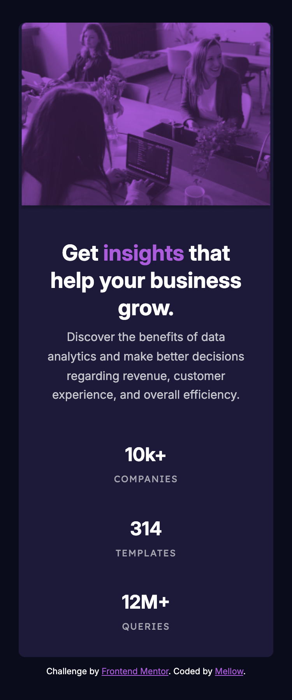
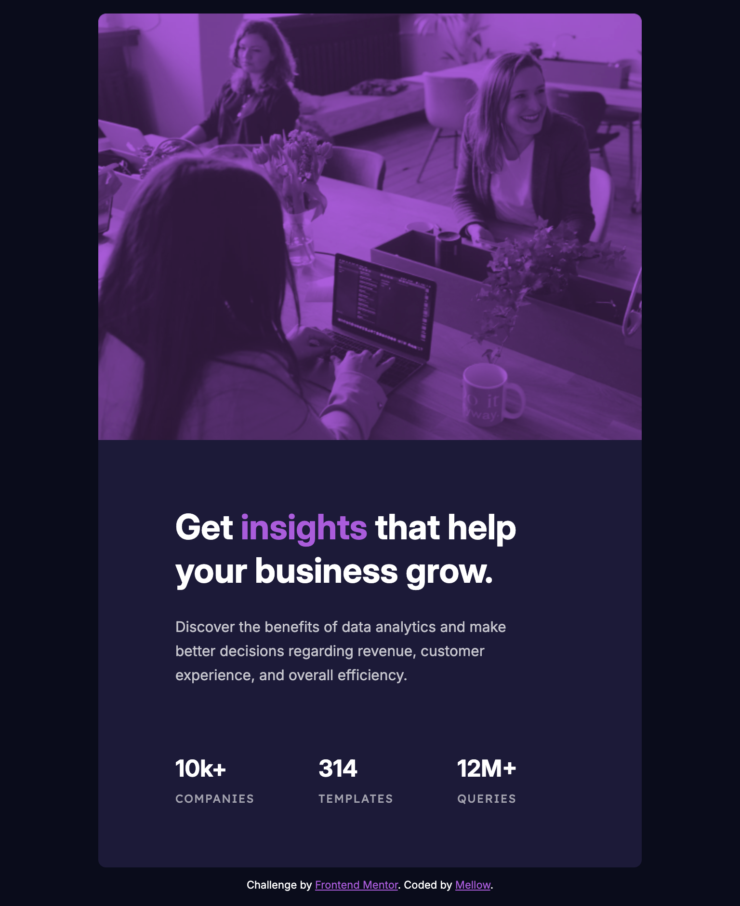
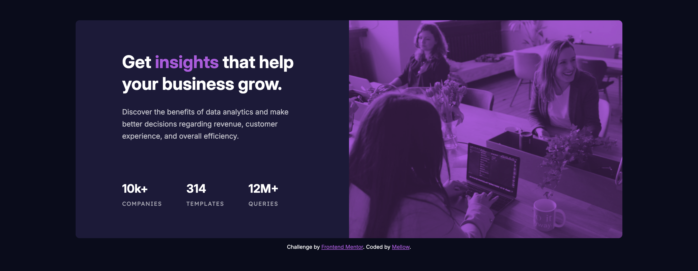

# Frontend Mentor - Stats preview card component solution

This is a solution to the [Stats preview card component challenge on Frontend Mentor](https://www.frontendmentor.io/challenges/stats-preview-card-component-8JqbgoU62). Frontend Mentor challenges help you improve your coding skills by building realistic projects. 

## Table of contents

- [Overview](#overview)
  - [The challenge](#the-challenge)
  - [Screenshot](#screenshot)
  - [Links](#links)
- [My process](#my-process)
  - [Built with](#built-with)
  - [What I learned](#what-i-learned)
  - [Continued development](#continued-development)
  - [Useful resources](#useful-resources)
  - [AI Collaboration](#ai-collaboration)
- [Author](#author)

## Overview

### The challenge

Users should be able to:

- View the optimal layout depending on their device's screen size

### Screenshot

### Links

- [Solution](https://www.frontendmentor.io/solutions/stats-preview-card-component-using-flexbox-cthPu4L8mE)
- [Live Site](https://stats-preview-card-mellow.netlify.app/)

## My process

### Built with

- Semantic HTML5 markup
- CSS custom properties
- Flexbox
- Mobile-first workflow

### What I learned

I learned how to use the `<picture>` and `<source>` elements to serve different image sizes for different device sizes. I also learned how `mix-blend-mode` can be used to blend separate HTML elements, such as applying a tinted overlay to an image underneath.

Additionally, I learned about the `<dl>`, `<dt>`, and `<dd>` elements and how they can be used to pair terms with their descriptions or values. In this project, I used them to semantically structure the company’s stats.

### Continued development

In this project, although I had access to the Figma file, I tried eyeballing the design elements first before checking the Figma specs for the correct spacing, line height, and font sizes. I think I did pretty well, but I want to continue practicing and improving my eye for detail.

I would also like to get more practice using mix-blend-mode. I wasn’t able to get the header image to perfectly match the color shown in the Figma file, so I ultimately worked around it by downloading the three header image versions directly from the design file and using those instead.

### Useful resources

- [PX to EM converter](https://nekocalc.com/px-to-em-converter) - My go to for px to em/rem conversions.

### AI Collaboration

I used AI to help create some of the class names. I had originally planned to use a `<ul>` for the company stats, but I wanted to explore whether there was a more semantic option. That led me to using a `<dl>` description list instead.

## Author

- Frontend Mentor - [@Mell-o](https://www.frontendmentor.io/profile/Mell-o)
